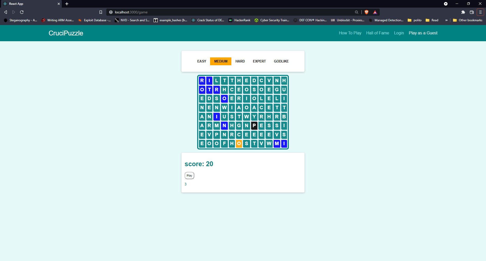

## "CruciPuzzle"
## Student: s303501 Sanan Ismail 

## React Client Application Routes

- Route `/`: Auth page 
- Route `/login`: Auth page 
- Route `/how-to-play`: HowToPlay page
- Route `/hall-of-fame`: HallOfFame page
- Route `/game`: Game page
- Route `/*`: Auth page  

## API Server

- POST `/api/auth/login`
  - request body: 
      {
	      "username": "<username>",
	      "password": "<password>"
      }
  - response:
    200 OK :
       {
          "data": {
		               "id": <userID>,
		                "username": "<username>"
                  }
        }
    401 Unauthorized:
        {
          	"data": "Unauthorized"
        }
    

- GET `/api/auth/logout`
  - response:
    200 OK :
        {
          "data": "OK"
        }
    401 Unauthorized:
        {
          	"data": "Unauthorized"
        }

- GET `/api/game/get-top-five`
  - response:
      200 OK :
        {
	      "data": [
	            	{
                  "username": "sanan",
                  "description": "GODLIKE",
                  "row": 20,
                  "column": 30,
                  "score": 125
	            	},
                ......
                ]
        }

- GET `/api/game/findWord`
  -request: query param:  word=<word>
  - response:
      200 OK :
        {
          "data": "<true> | <false>"
        }

- GET `/api/game/generate-grid/:id`
  -request: path variable: <:id> (id means gameId which refers to the game difficulties)
  - response:
      200 OK :
        {
          "data": [
          
                     ["A","B","C", ....],
                     ...
                   ]
        }

- GET `/api/game/difficulties`
  - response:
      200 OK :
       {
	      "data": [
              {
                "id": 1,
                "description": "EASY",
                "row": 4,
                "column": 6,
                "created_at": "2022-01-08 21:43:53",
                "updated_at": "2022-01-08 21:43:53"
              },
                ....
                ]
       }

  - POST `/api/game/insert-score`
     - request body: 
       {
          "userId": <userId>,
          "gameId": <gameId>,
          "score":  <score>
        } 

     - response:
      200 OK :
        {
          "data": "OK"
        }

## Database Tables

- Table `user` - contains id, username, password, created_at, updated_at  
- Table `game` - contains id, description, row, column, created_at, updated_at
- Table `scores` - contains id, user_id, game_id, score, created_at, updated_at

## Main React Components

- `NavBar` (in `MainNavigation.js`): Ability to route between the App features
- `Login` (in `LoginForm.js`): Authenticating the user
- `Hall Of Fame` (in `Scores.js`): Displaying the top-five scores in a table
- `How To Play` (in `HowToPlayRules.js`): Displaying the game rules
- `Game` (in `GameGrid.js`,`Difficulties.js`,`GameGridBoard.js`): Once you are authenticated or played as a guest you will be directed to the game page. By default is the Easy level difficulty and then you have the option to choose different difficulty levels
- `Context` (in `AuthContext.js`): The app context which can be used globally in the app to provide the state of the user if authenticated in or not, contains the login / logout function
- `Card` (in `Card.js`): Container which is used to hold react components (HowToPlayRules, Difficulties, ...)
- `Loading Spinner` (in `LoadingSpinner.js`): U/I component that shows a loading spinner while waiting for a response from the server.
- `Layout` (in `Layout.js`): Component that holds the navigation bar and what is inside the main page
- `App` (in `App.js`): Contains the Layout component and route functions

## Screenshot

## Users Credentials
- <username>, <password>
- sanan, sanan
- suma, suma
- ismail, ismail
